# Звіт: Налаштування Snyk SCA для juice-shop

## Мета
Інтеграція Snyk у GitHub Actions для виконання аналізу складу програмного забезпечення (SCA) на Node.js додатку juice-shop.

---

## Крок 1: Підготовка репозиторію
Створено власний репозиторій `juice-shop-github-actions.Lab2` на основі існуючого проєкту. Репозиторій відв'язано від оригінального форку для незалежної роботи.

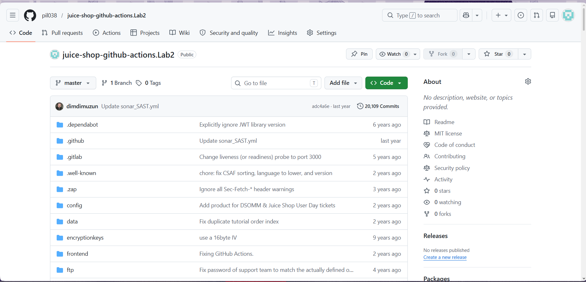

---

## Крок 2: Реєстрація в Snyk та авторизація через GitHub
Виконано вхід у Snyk через GitHub OAuth. Snyk запросив доступ до акаунту `pil038`.

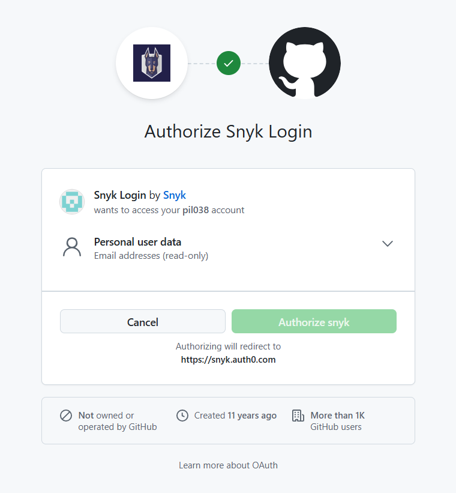

---

## Крок 3: Вибір методу інтеграції
На сторінці налаштування обрано інтеграцію через **GitHub** як метод підключення до коду.

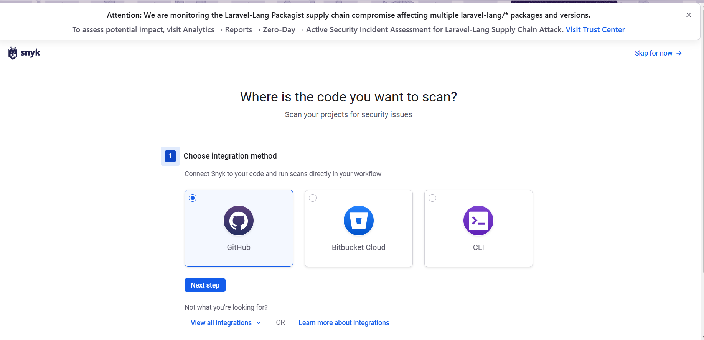

---

## Крок 4: Налаштування автоматизації
Увімкнено функції автоматизації Snyk: Pull Request Checks, New Fix Pull Requests, Dependency Upgrade Pull Requests та Snyk Code.

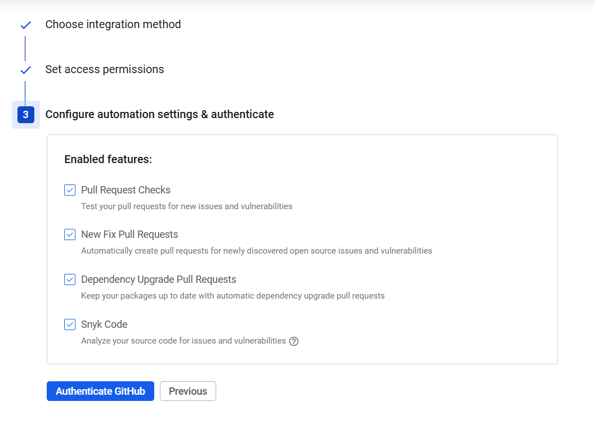

---

## Крок 5: Авторизація Snyk у GitHub
Підтверджено доступ Snyk до публічних репозиторіїв акаунту `pil038`.

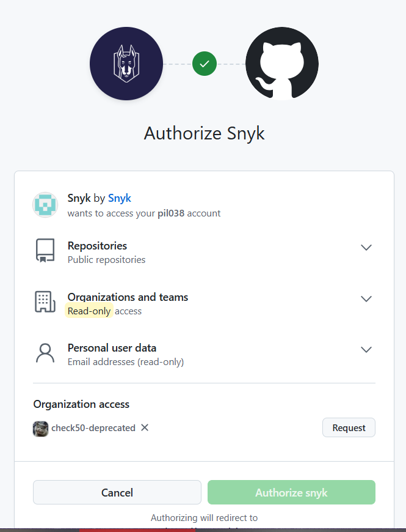

---

## Крок 6: Dashboard Snyk після успішної авторизації
Після успішної авторизації відкрився Snyk Dashboard з можливістю додавання проєктів.

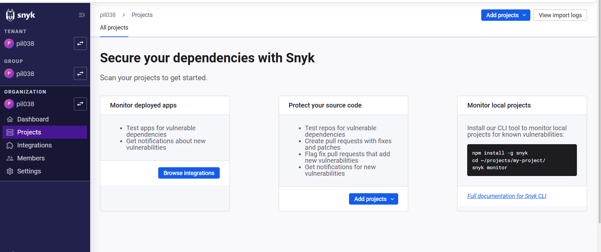

---

## Крок 7: Вибір репозиторію для сканування
Обрано репозиторій `juice-shop-github-actions.Lab2` для імпорту та аналізу в Snyk.

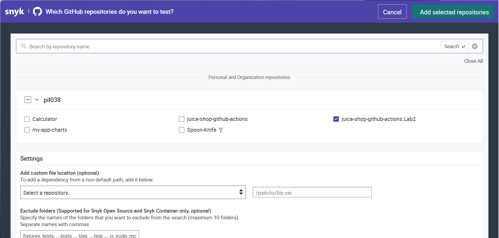

---

## Крок 8: Результати імпорту проєкту
Snyk успішно імпортував проєкт. Створено проєкти для: Dockerfile, package.json, frontend/package.json та Snyk Code supported files. Помилка для `frontend/tsconfig.json` — некритична (синтаксична помилка у файлі конфігурації).

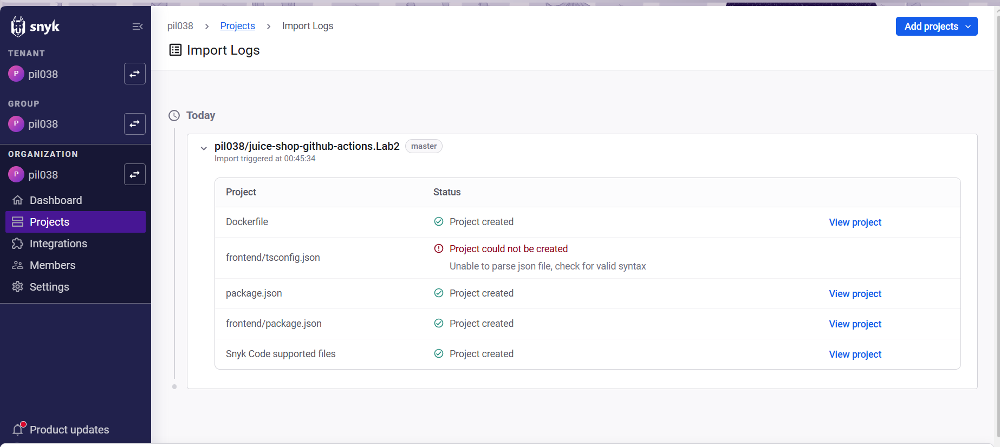

---

## Крок 9: Отримання Auth Token зі Snyk
Перехід до налаштувань акаунту Snyk (`Account → General`) для отримання токену автентифікації `SNYK_TOKEN`.

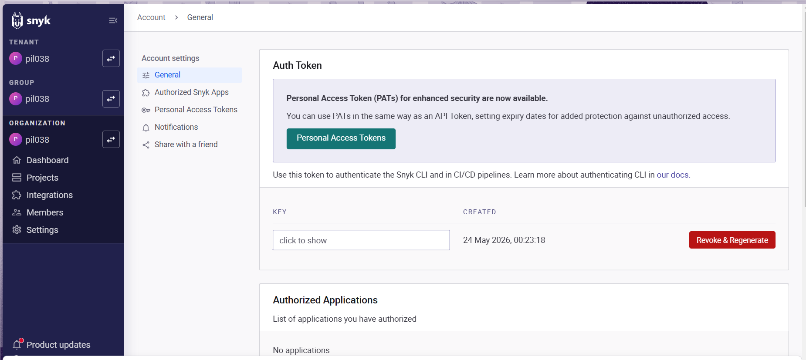

---

## Крок 10: Додавання SNYK_TOKEN у GitHub Secrets
Секрет `SNYK_TOKEN` успішно додано до репозиторію через `Settings → Secrets and variables → Actions → New repository secret`.

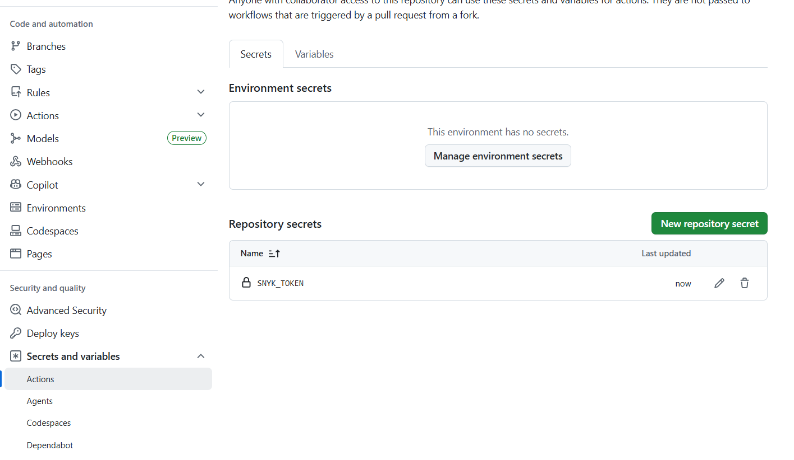

---

## Крок 11: Створення файлу GitHub Actions Workflow
Створено файл `.github/workflows/Snyk.yml` з конфігурацією для запуску SCA сканування при кожному push або PR до гілки `master`.

```yaml
name: SOFTWARE COMPOSITION ANALYSIS using Snyk

on:
  push:
    branches:
      - master
  pull_request:
    branches:
      - master

jobs:
  snyk:
    runs-on: ubuntu-latest
    steps:
    - name: Checkout repository
      uses: actions/checkout@v4

    - name: Run Snyk to check for vulnerabilities
      uses: snyk/actions/node@master
      env:
        SNYK_TOKEN: ${{ secrets.SNYK_TOKEN }}
```

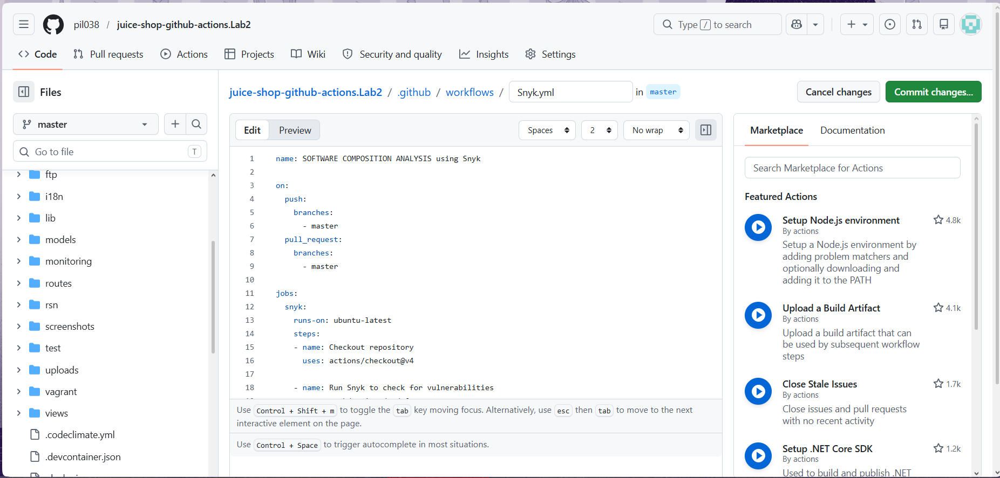

---

## Крок 12: Видалення дублюючого файлу workflow
У репозиторії існував старий файл `snyk.yml`. Його видалено щоб уникнути конфлікту з новим файлом `Snyk.yml`.

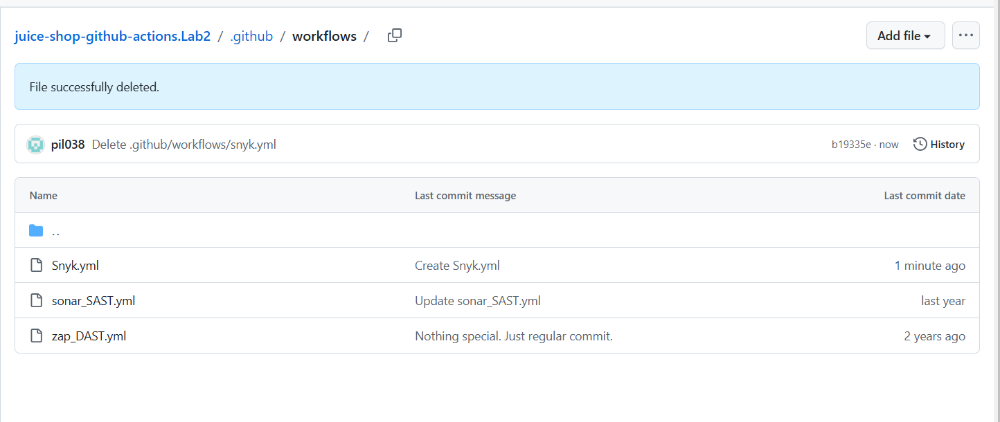

---

## Крок 13: Запуск Workflow
Після коміту автоматично запустились workflow. Видно запуск **SOFTWARE COMPOSITION ANALYSIS using Snyk** разом з іншими workflow з репозиторію.

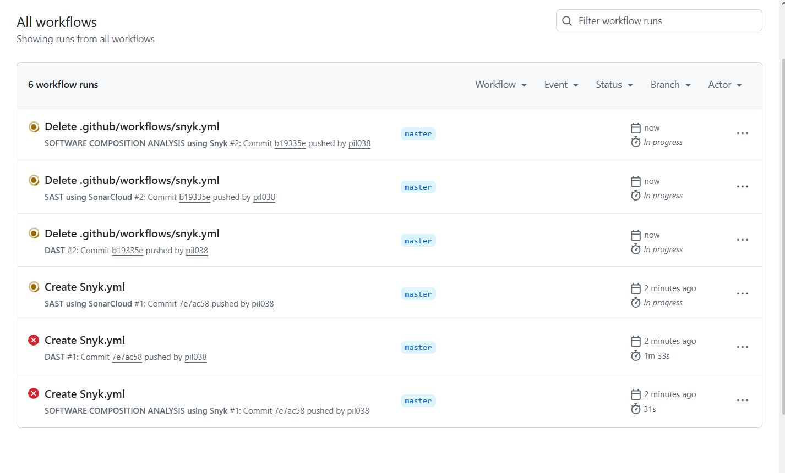

---

## Крок 14: Результат виконання Workflow
Workflow **SOFTWARE COMPOSITION ANALYSIS using Snyk #1** завершився зі статусом **Failure** за 31 секунду. Це очікувана поведінка — Snyk повертає код помилки коли виявляє вразливості.

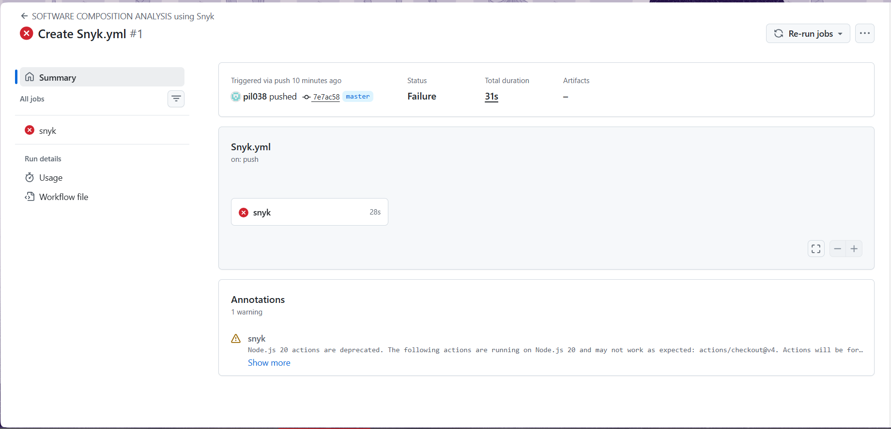

---

## Крок 15: Детальні результати сканування
Snyk виявив критичні проблеми безпеки у залежностях проєкту:
- Перевірено **1004 залежності**
- Знайдено **159 вразливостей** у **308 вразливих шляхах**

Приклади виявлених вразливостей:
- **NULL Pointer Dereference** [Medium] в `qs@6.13.0`
- **Allocation of Resources Without Limits** [High] в `qs@6.13.0`
- **Prototype Pollution** [High] в `unset-value@1.0.0`

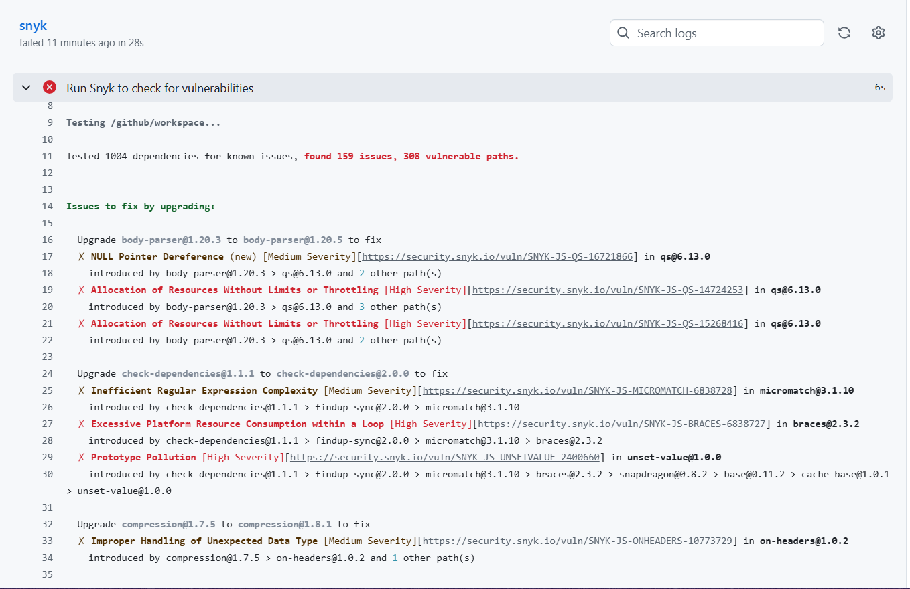

---

## Висновок
Успішно налаштовано GitHub Actions Workflow для інтеграції Snyk SCA:
- Workflow автоматично запускається при кожному push або PR до гілки `master`
- Snyk сканує всі залежності проєкту та надає детальний звіт про вразливості
- Використано секретну змінну `SNYK_TOKEN` для безпечної автентифікації
- Виявлено 159 вразливостей — це очікуваний результат, оскільки juice-shop є навмисно вразливим додатком для навчання безпеці
